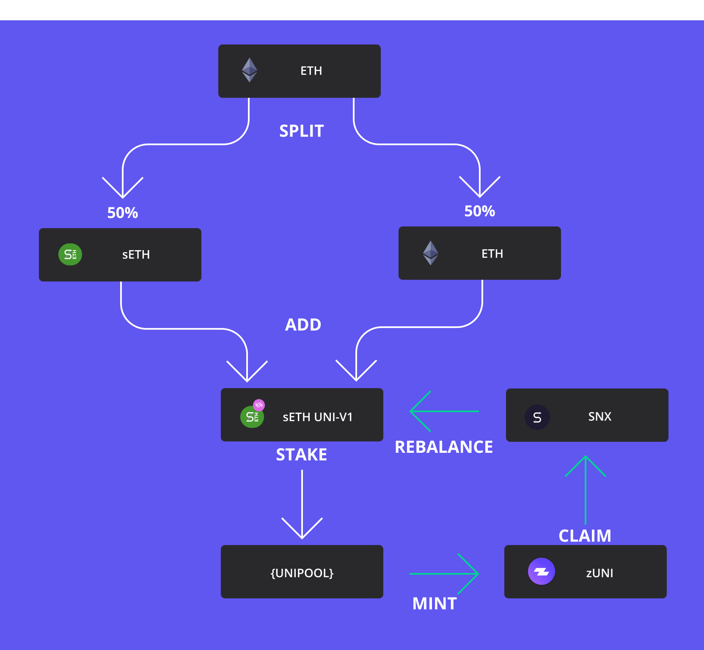

# 🤐Zips

### [Zips ](https://defitutorials.substack.com/p/zuni-programmable-pooling-incentives)are tokens which represent a claim on multiple positions/strategies and rebalances with just one token.

### **First use-case: zUNI = Tokenized sETH Pool with SNX Incentives Rebalancer.**

We are big fans of Synthetix and are always looking for ways to improve the experience for this community. 

For example, our [sETH Unipool Zap](https://defizap.com/zaps) helps users add liquidity to the sETH&lt;&gt;ETH Pool on Uniswap in one-transaction, using just one asset \(ETH or sETH or other ERC20s\). Inputs are split into appropriate proportions to enter the pool with. In return sETH LP tokens are minted which represent your claim on liquidity provided + accrued exchange fees. 

As soon as the new [Unipool contract for SNX rewards was announced](https://blog.synthetix.io/new-uniswap-seth-lp-reward-system/), we added a [visual interface](https://defizap.com/zaps/unipoolseth) to help users easily stake their sETH LPs in Unipool contract:

But we knew we had to do more. Today we are proud to propose something we already have available for testing - **zUnipool tokens or simply zUNI**. 

zUNI tokens represent a claim on sETH LP stake in Unipool + accrued SNX incentives from sETH Unipool Staking Reward system, which are auto-rebalanced into additional sETH LPs and re-staked in Unipool contract.

zUNI users can convert their sETH LPs into zUNI tokens at any point, by calling _**stakeMyShare**_. 

Likewise, they can redeem their zUNI for their original sETH LPs + additional sETH LPs \(accrued from rebalancing SNX rewards into additional sETH LPs\), by calling _**getMyStakeOut**_. 

### **Motivation:**

Up until recent deployment of Unipool contract, SNX rewards for sETH LPs on Uniswap were essentially distributed manually.

* **Before**: Take snapshots of LP addresses and airdrop SNX rewards proportionally.
* **Now**: Stake LP tokens in Unipool which proportionally accrue SNX rewards every second, are redeemable anytime to:
  * **sETH LP tokens + accrued SNX rewards.**
  * **JUST SNX rewards.**
  * **JUST some sETH LP tokens.**
* **Why zUNI?**
  * Once staked in Unipool, sETH LP tokens cannot be moved - zUNI is an ERC20 which can be _**transferred freely**_ and is always proportionally redeemable for an ever growing amount of sETH LPs.
  * Accrued SNX rewards are not being utilized - anytime zUNI is minted or redeemed, accrued SNX rewards for all zUNI holders will _**rebalance into sETH LPs**_ which are re-staked to accrue SNX rewards at a faster rate.
  * _**Improve sETH&lt;&gt;ETH peg**_ with every SNX rebalance as SNX is used to buy sETH from Uniswap in order to obtain necessary proportions to obtain LPs from adding sETH+ETH liquidity to the pool.

### **Additional information:**

#### Contracts:

* [zUnipool.sol](https://github.com/amateur-dev/Unipool/blob/master/contracts/zUniPool.sol)
* [Readme](https://github.com/amateur-dev/Unipool/blob/master/README.md).md
* [Unipool.sol](https://github.com/k06a/Unipool/blob/master/contracts/Unipool.sol) {original UniPool}

#### **Testing on forked mainnet instructions.**

_Why testing on Forked Mainnet:_

The Contract that we have developed and in the process of testing requires to interact with \(a\) the Unipool contract that is giving out the rewards and \(b\) Uniswap, to be able to convert the underlying SNX into sETH LP tokens.  We wanted to test these functionalities in “as close to as real mainnet” situations considering the quantum of SNX required for distribution {yes, that can be gamed on a test net} and \(most importantly\) the deep volume that exists on Uniswap {which is only on the mainnet \(creating that on a testnet would be very cumbersome\)}.  Hence, our entire testing has been on a forked version of the mainnet.

_**Instructions:**_

* _**Video Tutorial:**_ [_**https://www.loom.com/share/53ead589fa584db49c228d6c0352b5f6**_](https://www.loom.com/share/53ead589fa584db49c228d6c0352b5f6)
* [https://medium.com/ethereum-grid/forking-ethereum-mainnet-mint-your-own-dai-d8b62a82b3f7](https://medium.com/ethereum-grid/forking-ethereum-mainnet-mint-your-own-dai-d8b62a82b3f7)
* Once Geth is running on port 8545, open a new terminal window
  * Type: “ganache-cli --fork http://localhost:8545 -e 30000”
    * This creates a network that simulates mainnet running on port 8546 with each address starting with 30,000 ETH
* \[WIP\] Pending for final push on repo, in a new terminal window, navigate to the Unipool folder
  * Type : “truffle test”
    * Contracts will be compiled and tests will be run. The status of each test is indicated by a checkmark or cross.

#### **Front-end \[WIP\]:**

To help us design and develop a worthy UI/UX, we partnered with one of our fellow MetaCartel members - [RaidGuild](https://raidguild.org/). This page will be launched as soon as the community approves, tests and audits zUNI smart contract.

### **Next Steps:**

1. [Proposal to Synthetix’s Grants DAO.](https://github.com/DeFiStrategies/snx-grants-dao/blob/master/proposals/zUNI.md)
2. Review code, submit PRs with your feedback here: [https://github.com/amateur-dev/Unipool](https://github.com/amateur-dev/Unipool).
3. Main-net deployment.
4. Are you interested in creating incentives to improve liquidity around your pool? **Submit a request:** [**https://airtable.com/shrQVmnmEdXkr0Xm3**](https://airtable.com/shrQVmnmEdXkr0Xm3)

   [Join the conversation](https://discord.gg/h6CGbuN)

